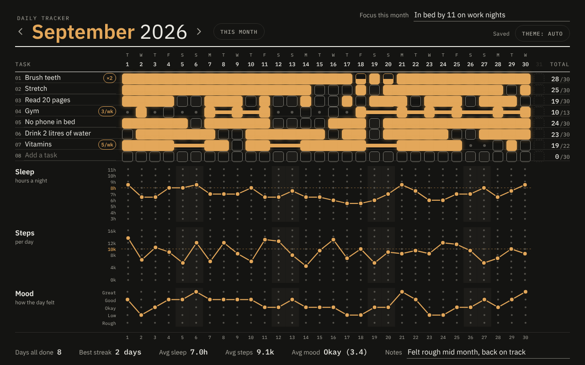
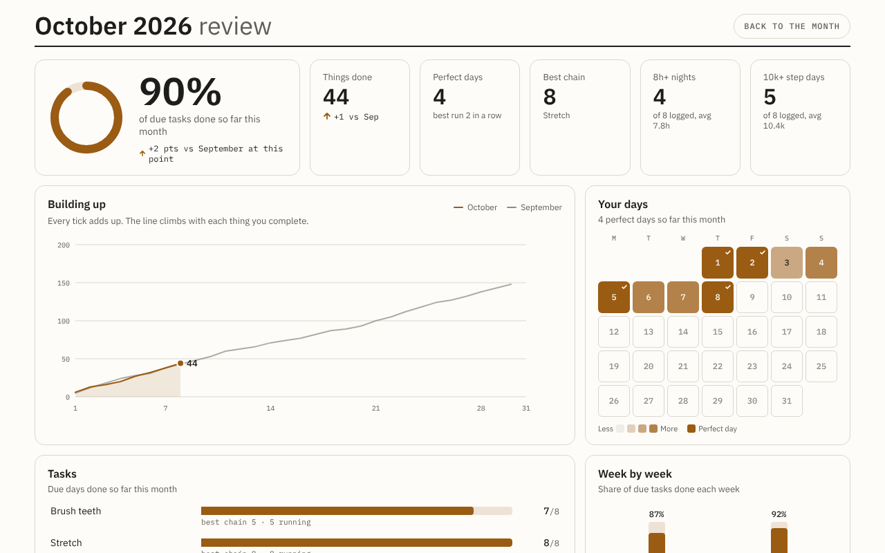

# Daily Tracker

A self-hosted habit, sleep, steps and mood tracker for a tablet in the living room, with a phone layout for checking in on the go. It's a digital take on a paper monthly habit grid: tick things off as you go and watch the month fill in.


| Dark theme | Phone |
|---|---|
|  |  |



## Features

- **Month at a glance.** Tasks down the left, days across the top, with sleep, steps and mood plots lined up underneath.
- **Chains.** Consecutive completed days join into one bar, so streaks and gaps stand out.
- **Times per day.** Set a task to ×2 for things like brushing your teeth. Each tap fills the square further.
- **Rest days.** Set which weekdays a task is due, like gym on Mon, Wed and Fri. Off days don't count against you, and chains carry through them.
- **Month review.** A completion ring, your tally building up against last month's pace, a calendar of perfect days, per-task streaks, week by week, and achievements to earn.
- **Celebrations.** A pop with each tick, and a moment when you finish a whole day or hit a 3, 7, 14, 21 or 30-day chain.
- **Phone and portrait layout.** Days run down and tasks across, with tabs for the plots. It switches automatically on rotate or resize.
- **Light and dark.** Follows the device, or pick one.
- **Saves itself.** Changes go to your server as you tap, as one readable JSON file per month.
- **Updates itself.** It pulls new versions from this repo overnight and checks each one before it goes live. Your data is never touched.
- **Tiny.** One Python file and a folder of web files. No dependencies and no build step.

## Quick start

On ZimaOS, copy `server.py` and `public/` to `/DATA/AppData/daily-tracker`. Then import [`zimaos-compose.yml`](zimaos-compose.yml) under **App Store > Install a customized app**, and open `http://<server-ip>:8090`.

Anywhere else with Python 3.9 or newer:

```
python3 server.py
```

Then open `http://localhost:8080`.

The [installation guide](docs/installation.md) has the details, plus tablet, phone and Home Assistant setup.

## Documentation

- [User guide](docs/user-guide.md): how everything works
- [Installation](docs/installation.md): ZimaOS, Docker, plain Python, tablets and phones
- [Updates](docs/updates.md): self-updating, pinning a version, rolling back
- [Configuration](docs/configuration.md): server and page settings
- [Data and API](docs/data-and-api.md): the file format, backups and the HTTP API
- [Development](docs/development.md): how the code works and how to change it
- [Troubleshooting](docs/troubleshooting.md): status messages and common fixes

## Security

There's no login. It's meant for your home network only, so don't forward its port to the internet. To use it away from home, go through a VPN such as Tailscale or WireGuard.
