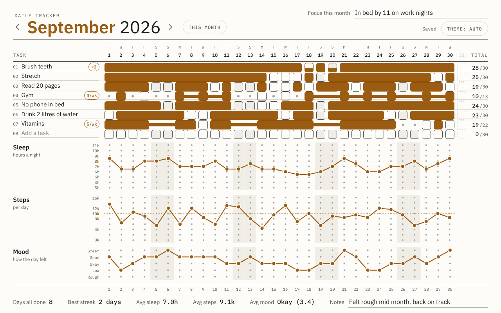
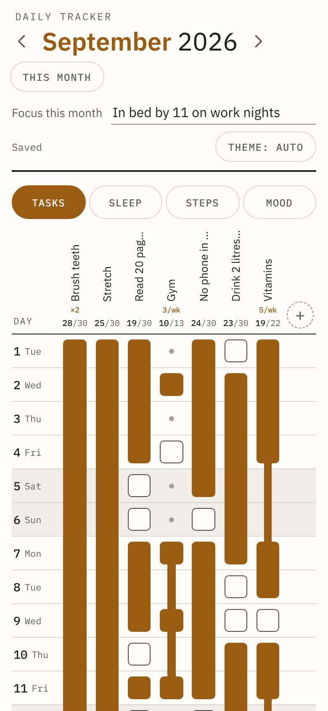
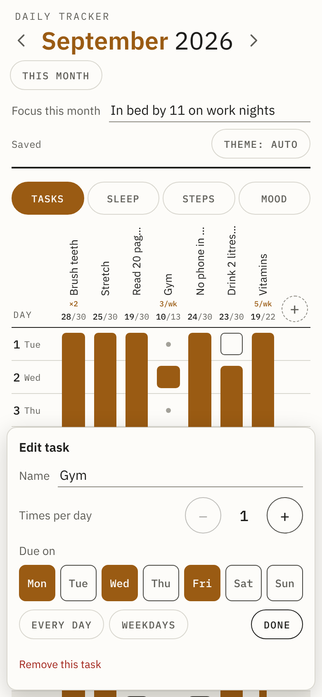
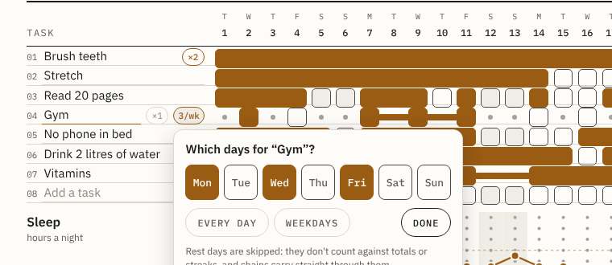
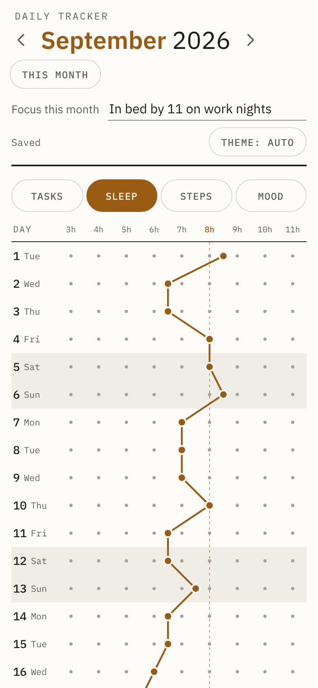

# User guide

[Back to the docs index](README.md)

- [Two layouts](#two-layouts)
- [The month](#the-month)
- [Tasks](#tasks)
- [Times per day](#times-per-day)
- [Rest days](#rest-days)
- [Chains](#chains)
- [Sleep, steps and mood](#sleep-steps-and-mood)
- [Stats](#stats)
- [Focus and notes](#focus-and-notes)
- [Theme](#theme)
- [Saving, offline and other devices](#saving-offline-and-other-devices)
- [Keyboard and accessibility](#keyboard-and-accessibility)

## Two layouts

The page picks a layout to suit the screen and switches straight away when you rotate the device or resize the window.

**Month sheet.** On a tablet in landscape or a desktop browser window, you get the whole month on one screen: tasks down the left, days 1 to 31 across the top, and the sleep, steps and mood plots underneath, all lined up on the same day columns.

**Portrait.** On a phone, a tablet in portrait, or a window narrower than about 900 px (or shorter than about 560 px), the month flips. Days run down the screen and tasks run across, so the month builds up downwards. Tabs at the top switch between Tasks, Sleep, Steps and Mood. The page opens on today's row and remembers which tab you were on.

| Month sheet | Portrait |
|---|---|
|  |  |

## The month

- The arrows either side of the month name go back and forward a month. When you're not on the current month, **This month** jumps back.
- Today is highlighted: its date is circled in the sheet layout and its row is tinted in portrait.
- Weekends are shaded.
- Days a month doesn't have (the 31st in September, say) show as dashed outlines in the sheet layout and are left out in portrait.
- At midnight the page moves on to the new day by itself. If you're looking at the current month when a new month starts, it moves on to the new month too.

## Tasks

**Ticking.** Tap a day's square to tick it, and tap again to clear it.

**Adding and renaming.**
- In the sheet layout, tap a task name (or "Add a task") and type. There are always at least eight rows.
- In portrait, tap a task's name at the top to open its edit sheet, or tap **+** to add a new one. The sheet has the name, times per day and which days it's due.

**Removing.**
- In portrait, open the task and tap **Remove this task**. This clears its name and its ticks for the month.
- In the sheet layout, clear the name. Any ticks on that row stay until you clear them.

**New months** start with the previous month's tasks, including times per day and rest days, with all the ticks empty. It copies from the most recent earlier month that has any named tasks.

**Totals.** The number on the right of each row (or under the name in portrait) is days done out of days due. For a task due every day, that's out of the days in the month. For a Mon, Wed, Fri task in October 2026, it's out of 13.

## Times per day

For things you do more than once a day, like brushing your teeth twice, set a task's times per day from 1 to 6.

- **Sheet layout:** tap the task's name and a small **×1** pill appears beside it. Tap the pill to step through ×1, ×2 up to ×6 and back to ×1. Once a task is ×2 or more its pill stays visible. A ×1 pill hides again to leave room for the name.
- **Portrait:** open the task and use **−** and **+**.

Each tap on a day then adds one and fills the square from the bottom. A ×2 task is half full after one tap and full (done) after two. One more tap clears it.

A day only counts as done once the square is full. Part-done days don't count towards totals or streaks and don't join chains.

If you change the number partway through a month, days you'd already completed stay complete, and part-done days keep their count.

## Rest days

For tasks you don't do every day, like the gym on Monday, Wednesday and Friday, set which weekdays the task is due.

- **Sheet layout:** tap the task's name and a **7/wk** pill appears. Tap it to open the day picker, then tap days on or off. **Every day** and **Weekdays** are shortcuts. Tap **Done**, tap outside, or press Escape to close it. Once a task has rest days, its pill (say **3/wk**) stays visible.
- **Portrait:** open the task and use the same day buttons on its sheet.

At least one day has to stay on.

Off days show as a small dot instead of a square. They don't count against the task's total, they're skipped when working out days all done and streaks, and chains carry straight through them.

You can still tap a rest day if you did the task anyway. It counts as a bonus, so a task's total can end up higher than its due days.

## Chains

Consecutive completed days join up into one solid bar, so a streak reads as an unbroken line and gaps stand out. In portrait the bars run downwards.

When a task has rest days, a chain carries on through them as a thinner link instead of breaking. So hitting every Mon, Wed and Fri gym session gives one continuous chain for the month.

In the dark theme, completed squares and chains glow slightly, a nod to the light-up calendar that inspired this.

## Sleep, steps and mood

| Plot | Range | Snaps to | Target line |
|---|---|---|---|
| Sleep | 3 to 11 hours | nearest half hour | 8 hours |
| Steps | 0 to 16,000 | nearest 500 | 10,000 |
| Mood | Rough, Low, Okay, Good, Great | each step | none |

**Sheet layout.** Tap a day's column at the right height to set it. Drag a finger or the mouse across several days to draw the line in one go. Tap an existing point again, without moving, to clear it.

**Portrait.** Each plot has its own tab and runs down the page, one row per day, with the value across. Tap a day's row at the right value to set it, and tap the same point again to clear it. Dragging scrolls the page here, so you can't draw across days in this layout.

Lines break where a day has no value, so missing days show as gaps rather than being filled in.

The ranges and targets can be changed in the page settings. See [Configuration](configuration.md#page-settings).

## Stats

The bar along the bottom works itself out as you go.

| Stat | What it counts |
|---|---|
| Days all done | Days where every named task that was due that day was done |
| Best streak | The longest run of such days in a row. Days where nothing was due are skipped, so they don't break a streak |
| Avg sleep | Average of the days with a sleep value |
| Avg steps | Average of the days with a steps value, in thousands |
| Avg mood | Average mood, shown as the nearest word and the number (1 is Rough, 5 is Great) |

Days all done and best streak only count days up to today in the current month and the whole month for past months. Only tasks with a name are included.

## Focus and notes

**Focus this month** at the top and **Notes** at the bottom are free text, saved with the month. The focus is a place for the one thing you're working on that month.

## Theme

The theme button cycles **Auto**, **Light** and **Dark**. Auto follows the device's own setting, so if the tablet switches to dark mode at night, so does the tracker. The choice is remembered per device.

## Saving, offline and other devices

Changes save automatically about half a second after you tap. The status next to the theme button shows what's happening.

| Status | Meaning |
|---|---|
| Saving | A change is on its way to the server |
| Saved | Everything is on the server |
| Not saved, retrying | The server couldn't be reached. It tries again every 5 seconds |
| Offline, showing this tablet's copy | The page couldn't load from the server, so it's showing the copy this device keeps |

If the server is briefly unreachable, keep the page open: everything you tap is held and sent once the connection is back. Each device also keeps a copy of what it last saved, which it shows if it can't reach the server when it loads.

You can have it open on several devices. Every few minutes, and whenever you come back to the page, it picks up changes made elsewhere, so a tick on your phone shows up on the tablet. If two devices edit the same month at exactly the same time, the last save wins.

When the server is updated to a new version, the page reloads itself within a few minutes. It won't reload while you're typing, dragging or have a picker open. See [Updates](updates.md).

## Keyboard and accessibility

- Every square, pill and button is a real button, labelled for screen readers with the task, the date, whether it's a rest day and how many of how many are done.
- **Tab** moves between controls, and **Enter** or **Space** ticks a square.
- **Enter** in a text field finishes editing.
- **Escape** closes the rest days picker or the task sheet.
- On Android, taps give a short vibration, and completing a multi-tap task gives a double pulse.
